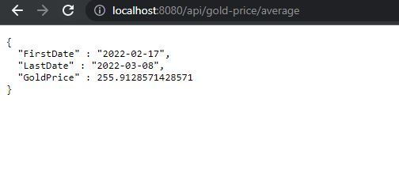

# NBP API

## General info
It's a simple project using NBP API to receive data about currency
exchange rates for the last 5 days and average gold price for the last 14 days.

## Manual Guide
To run Internet applications on your device, compile NbpApplication and then enter in the browser:

- [https://localhost:8080/api/gold-price/average](https://localhost:8080/api/gold-price/average)
  to display the average gold price for the last 14 business days.

or

- [https://localhost:8080/api/exchange-rates/{currencyCode}](https://localhost:8080/api/exchange-rates/{currencyCode})
  (for example USD) to display currency exchange rate PLN to {currencyCode} for the last 5 business days.

### Technologies used

- Java (Spring)

### Browser support

The project has been prepared for the browser Google Chrome v84+

Tested on IntelliJ IDEA ultimate 2021.2.2

### Sample program results

#### Average gold price for the last 14 days

#### Exchange rate for USD

